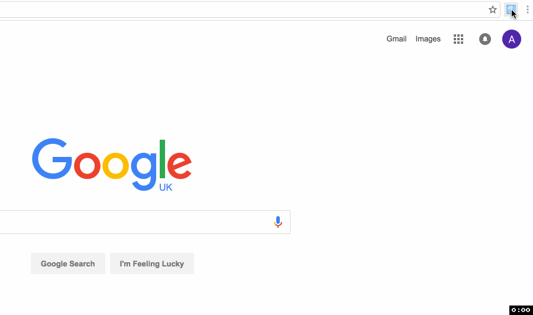

# Chrome Extension Angular2 Sidebar
Chrome extension starter that opens a sidebar with an Angular2 page



## How to use
First of all, clone this repository into your machine:
```
git clone https://github.com/bertofer/chrome-extension-angular2-sidebar
```

Then navigate to src/page-sidebar/ and execute:
```
npm install
```

This will install all the required modules needed to build the sidebar page. Then, to build the sidebar do

```
npm run build-prod
```

It will generate the dist/ folder with the compiled version that the index.html is expecting to use.
While you are developing, you can use `npm run build` to build the dev version, or `npm run build-watch` to rebuild each time you save any of the files.

## Thanks
Special thanks to:
- [angular2-typescript-webpack](https://github.com/schempy/angular2-typescript-webpack) for the article on how to configure angular2.
- [extensionizr](https://github.com/altryne/extensionizr), for the extension starter, and the icons.

## License
The MIT License (MIT) Copyright (c) 2016 Alberto Fernandez
